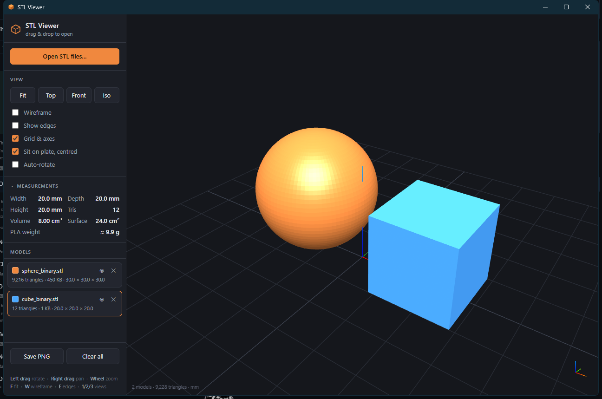

<div align="center">

# STL Viewer

**A fast, self-contained STL viewer for Windows.**
Drag and drop `.stl` files to inspect 3D models — with dimensions, volume
and print-weight estimates.

<br>

[](https://github.com/steverowley/stl-viewer/releases/latest/download/STL-Viewer-1.0.0-win-x64.zip)

[](https://github.com/steverowley/stl-viewer/releases/latest)
[](#requirements)
[](https://github.com/steverowley/stl-viewer/releases/latest)
[](LICENSE)

<sub>No installation dependencies · Works offline · No telemetry</sub>

</div>

<!--
  Badges are static because this repository is private: shields.io endpoints
  that query the GitHub API (release version, download count) render as
  "invalid" to anyone without access. If this repo is ever made public,
  these can become live:
    https://img.shields.io/github/v/release/steverowley/stl-viewer
    https://img.shields.io/github/downloads/steverowley/stl-viewer/total
  Remember to bump the hard-coded version/size here on each release.
-->



---

## Download & install

<table>
<tr><td width="60" align="center"><b>1</b></td>
<td><b><a href="https://github.com/steverowley/stl-viewer/releases/latest">Download the latest release</a></b><br>
<sub>A single <code>.zip</code>, about 41 MB.</sub></td></tr>
<tr><td align="center"><b>2</b></td>
<td><b>Extract it anywhere</b><br>
<sub>Right-click the zip → <i>Extract All…</i></sub></td></tr>
<tr><td align="center"><b>3</b></td>
<td><b>Run <code>install.bat</code></b><br>
<sub>Adds a Start Menu entry and optionally opens <code>.stl</code> files by
double-click. Installs to your own user folder — no admin rights needed.</sub></td></tr>
</table>

Prefer not to install? Just run **`STL Viewer.exe`** straight from the extracted
folder — it works the same. To remove it later, run **`uninstall.bat`**.

> [!NOTE]
> The app is unsigned, so Windows SmartScreen may warn on first launch.
> Click **More info → Run anyway**. This is normal for independent software;
> removing the warning requires a paid code-signing certificate.

### Requirements

Windows 10 or 11 (64-bit). Nothing else — the .NET runtime is bundled, and the
WebView2 component it renders with already ships with Windows.

---

**Proprietary software.** © 2026 Steve Rowley. All rights reserved.
See [LICENSE](LICENSE) — the source is visible, but no licence to use, copy or
distribute is granted.

## Features

- **Drag and drop** — drop one or many `.stl` files onto the window
- **Binary and ASCII STL**, auto-detected by byte length rather than the
  unreliable `solid` keyword, so binary files with a misleading header still load
- **Measurements** — bounding box, triangle count, volume, surface area and an
  approximate PLA print weight
- **Multi-model** — files are laid out side by side on the plate so they never
  intersect; per-model colour, visibility and removal
- **Views** — orbit, pan, zoom; front/top/iso presets; wireframe and edge overlay
- **Single instance** — double-clicking another `.stl` loads it into the open
  window instead of spawning a second one
- **Save PNG** of the current view
- Fully offline. No telemetry, no network access.

## Controls

| Action | Control |
|---|---|
| Rotate | Left-drag |
| Pan | Right-drag |
| Zoom | Mouse wheel |
| Fit to view | `F` |
| Wireframe | `W` |
| Show edges | `E` |
| Front / Top / Iso | `1` / `2` / `3` |
| Remove selected | `Delete` |

## Architecture

A WinForms host embedding **WebView2**, with the entire UI (HTML/CSS/JS +
three.js) compiled into the executable as embedded resources and served from
memory over a virtual origin. The result is a single self-contained `.exe` with
no loose assets and no install-time dependencies.

STL parsing, geometry and measurement are hand-written — three.js is used only
for rendering.

```
index.html              the viewer UI (also runs standalone in a browser)
vendor/three.min.js     three.js r149, rendering only
app/src/Program.cs      WinForms + WebView2 host, single-instance IPC
app/src/StlViewer.csproj
test/                   parser, browser and file:// test suites
```

## Building

Requires the .NET 9 SDK.

```bash
cd app/src
dotnet publish -c Release -o ../out
```

Output is a single `STL Viewer.exe` (~47 MB self-contained).

## Tests

Serve the repository root on port 8731, then:

```bash
node test/harness.js     # parser + measurement vs exact known geometry
node test/cdp.js         # full UI in real WebGL: drag/drop, layout, controls
node test/file-mode.js   # file:// fallback
```

42 assertions total. Measurement accuracy is checked against analytically known
values (a 20 mm cube must measure exactly 8.000 cm³ and 24.00 cm²).

## Notes

- Measurements assume millimetres, the usual STL convention.
- Volume uses signed-tetrahedron summation — exact for closed meshes,
  approximate for open or non-manifold ones.
- PLA weight assumes 1.24 g/cm³ at 100% infill.

## Third-party components

See [THIRD-PARTY-NOTICES.md](THIRD-PARTY-NOTICES.md).
